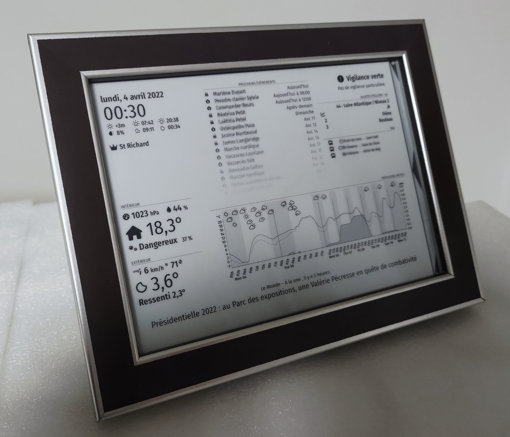

# Weather station e-ink frame

This is a project (hardware and software parts) designed to have a full Weather station (and many more features) displayed on a e-ink screen put in a photo frame with tactile buttons.

It is done with a Raspberry Pi, a 7.8" e-ink screen, a capacitive touch sensor, a temperature/humidity/pressure/gas sensor and needs a internet connection.

## Status

This project is fully functional.

Some improvements can be done (see [MagicMirror² Installation](software.md#Disclaimer)) and more features may be added in the future (see below).

## Hardware

Complete guide is in [hardware part](hardware.md).

It includes:
- Information on schematic
- Bill Of Material

## Software

Complete guide is in [software part](software.md).

It includes:
- Installation and configuration of OS on Raspberry
- Installation and configuration of [MagicMirror²](https://magicmirror.builders/) and all the modules

## Features

At this stage, all the ticked features are available (the other features may never be done).
It can also be customized by adding new modules (see [MagicMirror² Installation](software.md#MagicMirror²)).

### Basic

- [X] Current day and time
- [X] sunrise/sunset
- [X] moonrise/moonset
- [X] Gain/loss of sun minutes since yesterday
- [X] Moon phase
- [X] Saint of the day

### Weather/outdoor

- [X] Indoor sensors:
  - [X] temperature
  - [X] humidity
  - [X] pressure
  - [X] air quality
- [X] Current weather with:
  - [X] temperature
  - [X] feel-like temperature
  - [X] humidity
  - [X] pressure
  - [X] wind
  - [X] UV index
  - [X] rain probability
  - [X] air quality
- [X] Graph of weather forecast for next days with:
  - [X] temperature
  - [X] feel-like temperature
  - [X] min/max temperature
  - [X] rain and snow
  - [X] weather icon
  - [X] humidity
  - [X] pressure
  - [X] wind
  - [X] UV index
  - [X] rain probability
  - [X] air quality
  - [ ] same curves for previous days
- [X] Alerts on the risk of rain, wind, ice...
- [X] Alerts on current active allergens
- [ ] Maps of winds, rain, lightning
- [ ] Historic graph of indoor sensor measures

### Calendar and tasks

- [X] Upcoming events in family calendar
- [X] Upcoming birthdays
- [X] Tasks (from Trello)

### Travels

- [X] Next upcoming used bus lines
  - [X] with alerts on this lines
- [X] Travel time to work
- [ ] Map of traffic
- [ ] Traffic for the next event in calendar

### Entertainment

- [X] Headlines of news
- [X] Current Spotify music (watch multiple accounts)
  - [X] with buttons for Spotify control (volume, next/previous, start/stop)
- [ ] Game of life

### Display

- [X] Different pages that can be accessed with buttons

### Advanced features (not yet planned)

- [ ] [Home Assistant](https://www.home-assistant.io/) interaction
- [ ] Communication with home sensors (indoor and outdoor)
