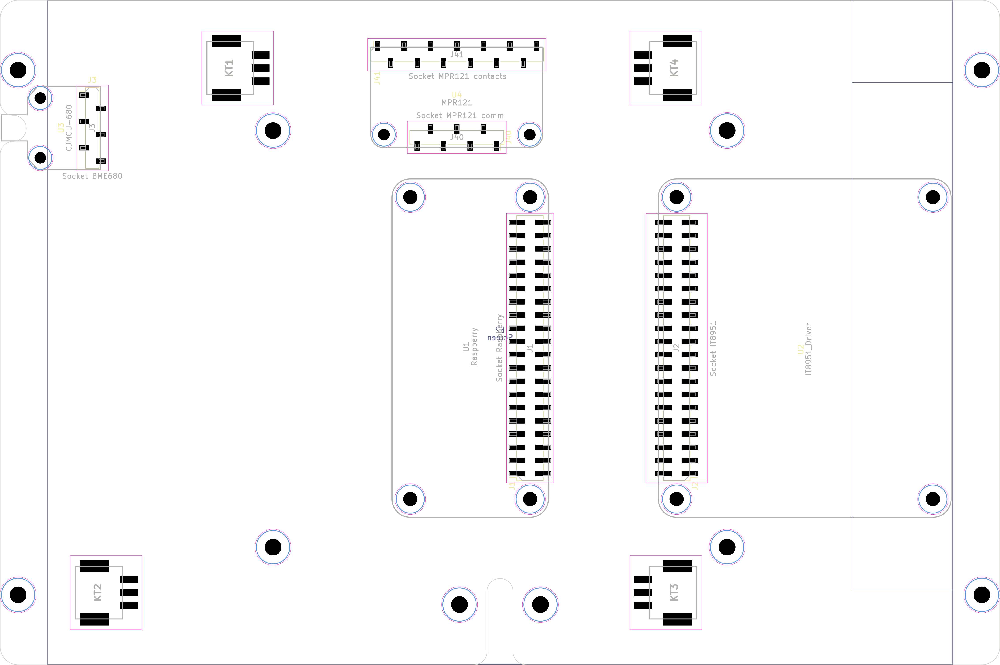
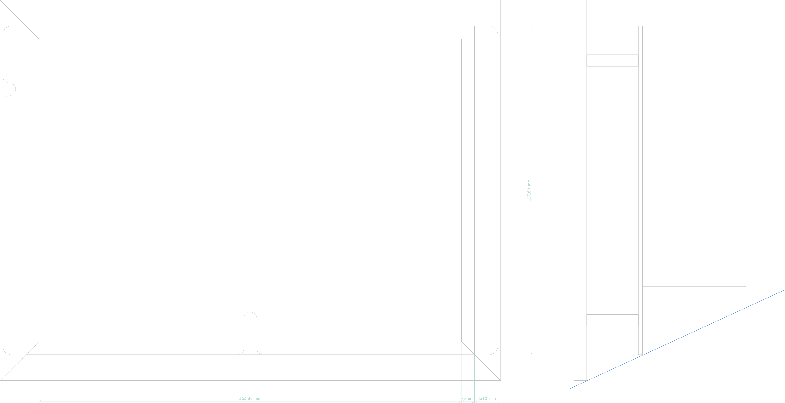
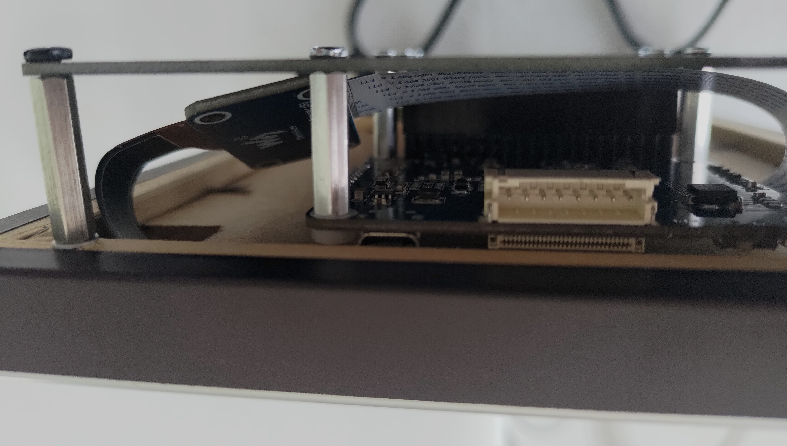

# Hardware part

This project was done with KiCad. Schematic and PCB are provided in this format.


- Schematic has a complete overview of all components needed (including sockets, holes and mounting stuff)
    - Each component is socketed
    - A schematic and footprint is provided for SMT socket, (but also component - not used in this project) and simple edge component
    - BOM references are included for Mouser provider
- PCB is done with SMT components to avoid potential shortcuts through accessible pins on background plate
    - Raspberry pi zero footprint is used
    - There is also a classical Raspberry pi footprint available in project (that can fit on PCB if desired)

The KiCad project is located in [pcb](pcb/) folder.





## BOM

Approximate price: 430€ (in 2022)

- e-ink screen: 175€
- Raspberry Pi Zero 2 W + sdcard, power…: 90€
- Temperature/Humidity/Pressure/IAQ Sensor: 20€
- Capacitive touch sensor: 15€
- PCB printing (+shipping): 30€
- Frame: 25€
- Screws, standoffs, nuts, sockets…: 75€

## Detailed BOM

| Description | Mouser ref. | Quantity | Comments |
| --- | --- | --- | --- |
| **UC** |
| Raspberry Pi Zero 2 W |  | 1 | Raspberry pi Zero 2 W on Raspberry website<br>Raspberry 4 should work too (enough space on board) |
| Socket Raspberry | 200-SSM120FDV | 1 | 2x20-pins female socket |
| Standoffs M2.5 | 761-M2105-2545-AL | 4 | Standoffs for Raspberry (pairing with nuts and screws) |
| **Temperature/Humidity/Pressure/IAQ Sensor** |
| CJMCU-680 |  | 1 | Temperature/humidity/pressure/IAQ sensor |
| Socket BME680 | 200-SSM106SSV | 1 | 6-pins female socket |
| **Screen** |
| Waveshare e-ink 7.8” display |  | 1 | 7.8inch e-paper on Waveshare website |
| Socket IT8951 | 649-95278-101-40LF | 1 | 2x20-pins male socket |
| IT8951 ribbon | 710-687640100002 | 1 | The one provided by Waveshare is too long |
| Standoffs M2.5 | 761-M2113-2545-AL | 4 | Standoffs for IT8951 driver (pairing with nuts and screws) |
| **Capacitive keys** |
| Adafruit MPR121 |  | 1 | Capacitive keys<br>Warn: 2 revisions exist with different pins |
| Socket MPR121 contacts | 200-SSM113SSV | 1 | 7-pins female socket |
| Socket MPR121 comm | 200-SSM107LSV | 1 | 13-pins female socket |
| Screw Terminal 01x03 | 651-1814647 | 4 | May be optional by directly ironing wires on pads |
| Wire 24AWG | 650-100G0111-0.25-0 | 4 | Probably less is needed (wires needed from screw terminals to frame picture turn buttons) |
| Terminal | 571-151439 | 12 (or # of needed keys) | To fix wires on frame picture turn buttons |
| Frame picture turn button |  | 12 (or # of needed keys) | As large as possible: used as capacitive keys<br>May be another system like rivets through frame |
| **Frame** |
| Photo frame |  | 1 | Inner dim. 127.6 * 173.8<br>(= screen size) |
| Insert M3 | 153-PFLA-M3-2 | 4 | To fix PCB in frame |
| Standoff M3 | 761-M2115-3005-SS | 4 | Length may differ according to frame height. A secure length is 23mm (pairing with inserts and screws) |
| Screw M3 | 534-9191-3 | 4 | To fix PCB in frame |
| Standoff M3 | 5164-SH1000-F | 2 | To support frame with correct slope (length/position may differ according to frame border size) |
| Nut M3| 144-04M030050HN | 2| To fix standoffs |
| Cable tie | 644-BC1M-S4-M0 | 1 | To maintain USB cable |
| **Misc** |
| Nut M2.5 | 144-04M025045HN | 8 | For Raspberry and IT8951 board |
| Screw M2.5 | 534-29300 | 8 | For Raspberry and IT8951 boards |
| Nut M2 | M80-2430000B | 4 | For CJMU-680 and Adafruit MPR121 boards |
| Screw M2 | 48SM006 | 4 | For CJMU-680 and Adafruit MPR121 boards |
| Standoff M2 | 710-971100244 | 4 | Standoffs for CJMCU-680 and Adafruit MPR121 (pairing with nuts and screws) |

## Photo frame

The frame have some constraints to fit with the PCB:

- back border must have width ≥ 10mm (insert has ~4mm diameter)
- border must have depth ≥ 12mm (insert has ~7mm length)



Nota: right side of the e-ink screen has a bigger margin than the three others sides (~ +5mm).
Ideally a hand-made frame may be created with a non symmetrical back border in order to hide this margin. 

### Standing

- 2 near mounting holes in middle left are made to have a tie that maintain the frame.
- 1 of this mounting hole + a mounting hole on the middle right are made to receive hooks.

## Test Waveshare e-Ink

To check that screen works, compile the following projects:

```sh
# Last version can be found at http://www.airspayce.com/mikem/bcm2835/
cd
wget http://www.airspayce.com/mikem/bcm2835/bcm2835-1.71.tar.gz
tar zxvf bcm2835-1.71.tar.gz
cd bcm2835-1.71/
./configure
make
sudo make check
sudo make install

cd
#git clone https://github.com/waveshare/IT8951-ePaper.git
# Correction of pointers for 64bits
git clone https://github.com/nodfur/IT8951-ePaper.git

cd IT8951-ePaper/Raspberry/
sudo make clean
sudo make -j4
```

Then run:

```sh
# Change value according to value specified on screen (each screen has a different value)
sudo ./epd -1.48 0
```

## Check i²c addresses

i²c communication can be checked with command:

```sh
i2cdetect -y 1
```

## Test BME680 sensor

To check that BME680 sensor works:

```sh
cd
git clone https://github.com/ftmazzone/bme680
cd bme680/
npm install
```

Then run:

```sh
# Test reading values
npm run testSensor
```

## Test MPR121

```sh
cd
git clone https://github.com/adafruit/node_mpr121
cd node_mpr121/
npm install
```

Then run and touch each key:

```sh
node example.js
```

## Assembly result

Here are some pictures from first realisation:





## Useful references during development

### KiCad

- KiCad EDA: [https://www.kicad.org/](https://www.kicad.org/)

### Raspberry Pi Zero 2 W

- Raspberry pinout: [https://pinout.xyz/#](https://pinout.xyz/#)
- 3D model by [Hasanain Shuja](https://grabcad.com/hasanain.shuja-1)

### Waveshare e-ink 7.8”

- Waveshare e-ink and driver hat: [https://www.waveshare.com/product/displays/e-paper/epaper-1/7.8inch-e-paper-hat.htm](https://www.waveshare.com/product/displays/e-paper/epaper-1/7.8inch-e-paper-hat.htm)
- Waveshare 7.8inch e-Paper HAT(including links to schematics, spec and datasheets): [https://www.waveshare.com/wiki/7.8inch_e-Paper_HAT](https://www.waveshare.com/wiki/7.8inch_e-Paper_HAT)

### Adafruit MPR121 module

- MPR121 Capacitive Touch Sensor on Raspberry Pi: [https://learn.adafruit.com/adafruit-mpr121-12-key-capacitive-touch-sensor-breakout-tutorial/overview](https://learn.adafruit.com/adafruit-mpr121-12-key-capacitive-touch-sensor-breakout-tutorial/overview)

### CJMCU-680

- 3D model by [Hasanain Shuja](https://grabcad.com/hasanain.shuja-1)
